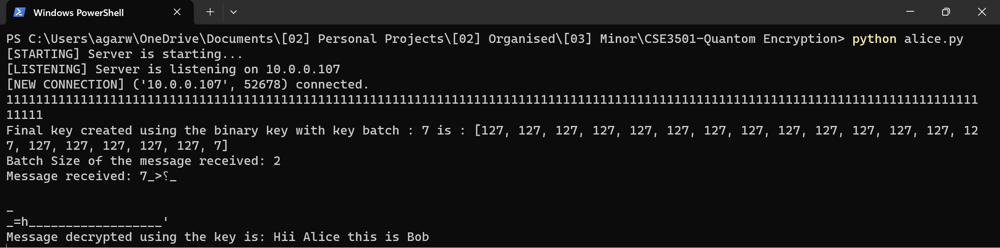
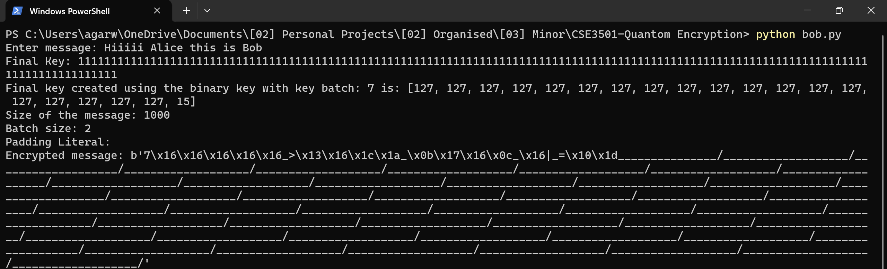

# CSE3501 Quantum Encryption Project

## Overview

CSE3501 Project - Quantum Encryption! This project focuses on implementing and enhancing quantum cryptography using Python. The main components of the project are the `bob.py` and `alice.py` files, representing the Bob and Alice entities in the quantum communication system.

## Features

- Quantum key distribution using quantum entanglement
- Secure communication between Bob and Alice
- Improved quantum encryption algorithms
- User-friendly interface for key exchange and message transmission

## Usage

1. Clone the repository: `git clone https://github.com/your-username/CSE3501-Quantum-Encryption.git`
2. Navigate to the project directory: `cd CSE3501-Quantum-Encryption`
3. Run the Bob script: `python bob.py`
4. Run the Alice script: `python alice.py`
5. Follow the on-screen instructions for key exchange and secure communication.

## Screenshots

#### Alice -
 

#### Bob -
 
## How It Works

### Quantum Key Distribution (QKD)

Quantum Key Distribution is a fundamental process in quantum cryptography that enables two parties, in this case, Bob and Alice, to securely exchange cryptographic keys over a potentially insecure communication channel. The steps involved in QKD include:

1. **Entanglement:** Bob and Alice each generate a pair of entangled qubits. These qubits are quantum particles that exhibit correlations such that the state of one qubit is directly related to the state of the other, no matter the distance between them.

2. **Measurement:** Bob and Alice perform quantum measurements on their respective entangled qubits. Due to the entanglement, the measurements are correlated. This correlation forms the basis for generating a shared secret key.

3. **Key Extraction:** After measurements, Bob and Alice share the results over a classical communication channel. They use these results to discard certain bits and extract a common secret key, known only to them.

4. **Security Analysis:** The security of the key is guaranteed by the principles of quantum mechanics. Any attempt to eavesdrop on the communication would disturb the quantum states, and detection of such interference can be used to detect a potential attacker.

## Improvements

This project includes several enhancements to traditional quantum cryptography:

- **Algorithmic Improvements:** The implemented quantum encryption algorithms have been optimized for improved security and efficiency.

- **Error Handling:** Robust error handling mechanisms have been incorporated to ensure reliable communication even in the presence of quantum errors.

- **Performance Optimization:** The code has been optimized for better performance, making it suitable for practical quantum communication applications.

## License

This project is licensed under the [MIT License](LICENSE). Feel free to use, modify, and distribute the code for your own purposes.
